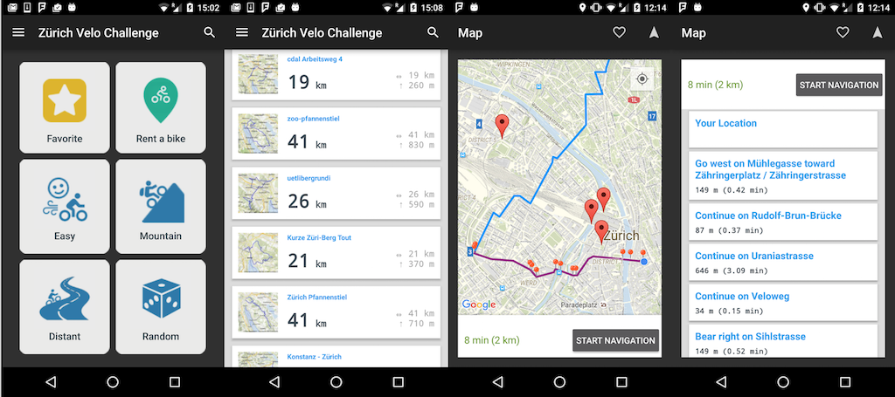

# Zurich-Velo-Challenge

Do you enjoy biking and exploring new routes? The new Zurich-Velo-Challenge(ZVC) app helps you discover new ways in the city of Zurich to make your next cycling trip awesome! More then 2500 routes are available on ZVC to help you discover this exciting and unique city. View routes on a map designed for cyclists that shows you relevant data at a glance, like distance and elevation. ZVC also assists you with navigation as it shows your current location and detail directions on an interactive map in real time while you’re following your route. Download it right now on your Android device and start your next journey.

### Data set
Data set we are planning to use in this app as shown as follow:
* Velowegnetz
* Routing-Service Velowege
* Veloverleih-Standorte in der Stadt Zürich
* Verfügbarkeit der Velos von «Züri rollt»
* Recommended Bike Routes in Zurich(Veloland, Bikemap.net)

Part of the data is provided by [Zurich Open Data](https://data.stadt-zuerich.ch/).

### Screenshots

## License

This work is licensed under a [Creative Commons Attribution-ShareAlike 4.0 International License](http://creativecommons.org/licenses/by-sa/4.0/).
